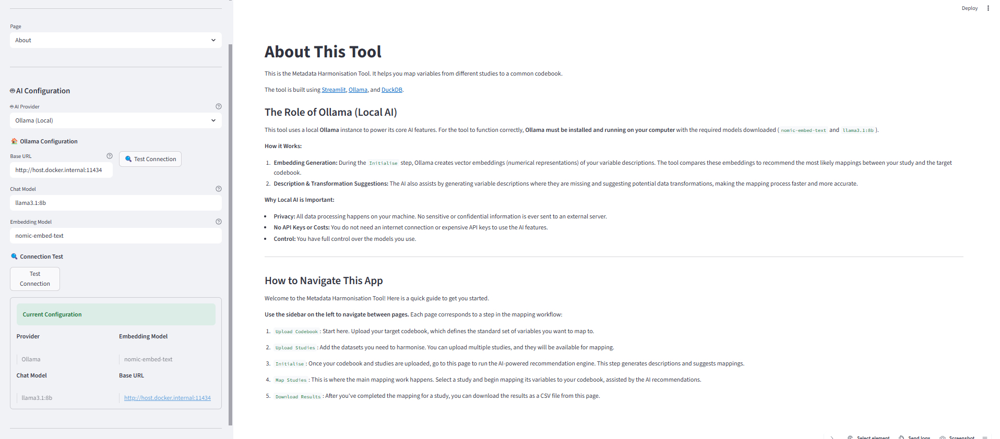

# Metadata Harmonisation 

[](https://fair-software.eu)

[](https://doi.org/10.5281/zenodo.18978530)

This is a [Streamlit](https://streamlit.io) application that facilitates the matching of variable names in a dataset to that of a target codebook, dramatically speeding up the first and often most tedious step in developing a common data model.


## What it does

The Metadata Harmonisation Interface provides a convenient portal to match variables from an incoming dataset to a target set of ontologies. In this way, the tool provides a similar role to that of the [White Rabbit tool](https://github.com/OHDSI/WhiteRabbit) utilized by the OHDSI community.

This tool differentiates itself by using Large Language Models to:
-   **Generate variable descriptions** where none have been provided.
-   **Recommend the most likely target variable** to map to.
-   **Support the creation and testing** of variable transformation instructions.
-   **Provide a confidence score** alongside mapping recommendations.
-   **Map ethnicity/population values to the [African Population Ontology (AfPO)](https://github.com/h3abionet/afpo)**, flag gaps, and submit missing terms directly to the ontology maintainers.

This dramatically speeds up the mapping process.

---

## AI Security at a Glance

Your API keys, data, and mapping decisions are handled with the following safeguards. Use the **SAFE** mnemonic to remember them. For the full mapping of threats to safeguards, see [`docs/AI_SECURITY.md`](docs/AI_SECURITY.md).

| Letter | Stands for | What it means in this tool |
|--------|-----------|---------------------------|
| **S** | **Secrets stay secret** | API keys are kept in memory only. They are never written to disk, never logged, and never appear in audit trails. |
| **A** | **Access is controlled** | Rate limiting caps AI calls at 60 per minute; requests time out after 30 seconds; only basic math (`+`, `-`, `*`, `/`) is allowed in transformation formulas. |
| **F** | **Failures are safe** | Retry logic waits longer between attempts; errors shown in the UI are sanitized so they do not leak paths or keys. |
| **E** | **Everything is traceable** | Every mapping save is appended to an audit log (`logs/mapping_audit.jsonl`) with operator, timestamp, and before/after values — but no secrets. |

### Quick checklist before sharing or deploying

- [ ] Keep `.env` out of version control (it is already in `.gitignore`).
- [ ] Do not paste API keys into notebooks, chat logs, or the audit viewer.
- [ ] Review `logs/mapping_audit.jsonl` to confirm no sensitive values are recorded.
- [ ] Set `STREAMLIT_SERVER_ENABLE_XSRF_PROTECTION=true` in production.

---



## 🚀 Quick Start

The easiest way to run the Metadata Harmonisation Tool is with Docker and Docker Compose. This method handles all Python dependencies and configuration for you.

### Pick your setup

- [Option A: Docker](#option-a-docker) (recommended)
- [Option B: No Docker](#option-b-no-docker)

### Option A: Docker

### Prerequisites

1.  **Docker**: Install [Docker Desktop](https://www.docker.com/products/docker-desktop/) for your operating system (Windows, Mac, or Linux).
2.  **Choose how Ollama is provided (two supported options)**:
    -   **Option A (Recommended): Ollama runs in Docker Compose**
        -   No local Ollama install required.
        -   Compose will start an `ollama` container and pre-download the default models on first run.
        -   If models are not present after startup, pull them inside the container:
            ```bash
            docker exec -it ollama-server ollama pull llama3.1:8b
            docker exec -it ollama-server ollama pull nomic-embed-text
            docker exec -it ollama-server ollama ls
            ```
    -   **Option B: Ollama runs on your host machine (outside Docker)**
        -   Install Ollama from [ollama.ai](https://ollama.ai/) and ensure it is running.
        -   Pull example models:
            ```bash
            ollama pull llama3.1:8b
            ollama pull nomic-embed-text
            ```
3.  **Optional cloud providers (configured in the sidebar: AI Configuration)**:
    -   **OpenAI**: Requires an `OPENAI_API_KEY`.
    -   **Anthropic (chat-only)**: Requires an `ANTHROPIC_API_KEY`.
    -   **Azure OpenAI**: Requires an Azure endpoint + API key.

### Step 1: Clone the Repository

```bash
git clone https://github.com/atwine/Metadata-Harmonisation-Tool.git
cd Metadata-Harmonisation-Tool
```

### Step 2: Configure Environment

Create a `.env` file from the example template. This file will hold your local configuration.

```bash
# On Linux or macOS
cp .env.example .env

# On Windows
copy .env.example .env
```

Open the `.env` file and set `OLLAMA_BASE_URL` depending on your chosen Ollama option:

- **Option A (Ollama in Docker Compose)**: set `OLLAMA_BASE_URL=http://ollama:11434`
- **Option B (host Ollama, app in Docker on Windows/Mac)**: set `OLLAMA_BASE_URL=http://host.docker.internal:11434`

Note: when using Option A, the Ollama container is published on host port `11435` by default to avoid conflicts with an existing host Ollama (`11434`). You normally don't need to change this.

> Important
> - For stability, set the Ollama Base URL in your `.env` file. Due to Streamlit's page reruns, the sidebar Base URL field can reset when navigating between pages. Defining `OLLAMA_BASE_URL` in `.env` keeps the URL consistent across the app.
> - Recommended values:
>   - Local Ollama (no Docker): `http://localhost:11434`
>   - Docker Compose (container-to-container): `http://ollama:11434`
>   - App in Docker, Ollama on host (Windows/Mac): `http://host.docker.internal:11434`

### AI provider configuration (Ollama / OpenAI / Anthropic / Azure OpenAI)

This app supports multiple AI providers. Configure it in the sidebar (**AI Configuration**):

-   **Ollama (Local)**: set Base URL and choose local chat + embedding models.
    - Recommended: set `OLLAMA_BASE_URL` in `.env` for persistence; the sidebar Base URL is a temporary override and may reset on page changes.
-   **OpenAI**: provide `OPENAI_API_KEY`, choose chat model + embedding model.
-   **Anthropic (chat-only)**: provide `ANTHROPIC_API_KEY` and choose a Claude model.
    -   Note: Anthropic does not provide embeddings; features that need embeddings require Ollama/OpenAI/Azure.
-   **Azure OpenAI**: provide your Azure endpoint + API key, and set deployment/model names.

### Step 3: Build and Run the Application

Use Docker Compose to build the image and start the application.

- **Option A (Ollama in Docker Compose)**:
  ```bash
  docker compose -f docker/docker-compose.yml up --build -d
  ```

- **Option B (host Ollama, start only the app container)**:
  - Ensure host Ollama is running and models are downloaded.
  - Set `OLLAMA_BASE_URL=http://host.docker.internal:11434` in `.env`.
  - Start only the app service (no Docker Ollama):
    ```bash
    docker compose -f docker/docker-compose.yml up --build --no-deps -d metadata-harmonisation-tool
    ```
    [src: https://docs.docker.com/compose/how-tos/production/]

-   `--build`: Builds the Docker image from the Dockerfile. You only need to do this the first time or when code changes.
-   `-d`: Runs the container in detached mode (in the background).

### Step 4: Access the Application

Once the container is running, open your web browser and navigate to:

**[http://localhost:8501](http://localhost:8501)**

You should now see the Metadata Harmonisation Tool interface.

---

### Option B: No Docker

If you prefer not to use Docker, you can set up a local Python environment using Conda or Micromamba.

Note: If you just installed Conda and the `conda` or `conda activate` commands are not recognized, initialize your shell once and then restart your terminal:

- Windows PowerShell: `conda init powershell`
- Windows Command Prompt (cmd): `conda init cmd.exe`
- macOS/Linux (bash): `conda init bash`

```bash
# Create and activate environment
conda env create -f environment.yml
conda activate harmonisation_env
pip install -r requirements.txt

# Configure the app
# 1) Copy .env and set OLLAMA_BASE_URL as described above (Quick Start → Step 2)
# 2) If using local Ollama, ensure models are present
ollama pull llama3.1:8b
ollama pull nomic-embed-text

# Run the app
cd app/
streamlit run app.py
```

Verify your setup:

- In the sidebar, open "AI Configuration" → run the Connection Test
- Or via CLI:

```bash
python validate_config.py --all-providers
```

Open http://localhost:8501 in your browser.

## 🚢 Deployment

### Building the Image

The Docker image is built using a multi-stage `Dockerfile` to create an optimized and secure production image. You can build it manually with:

```bash
docker build -f docker/Dockerfile -t atwine/metadata-harmonisation-tool:latest .
```

### Pushing to Docker Hub

Scripts are provided to simplify pushing the image to Docker Hub.

1.  **Login to Docker Hub**:
    ```bash
    docker login
    ```
2.  **Run the push script**:
    ```bash
    # On Linux or macOS
    chmod +x docker/push-to-dockerhub.sh
    ./docker/push-to-dockerhub.sh

    # On Windows
    .\docker\push-to-dockerhub.bat
    ```

---

## 🔧 Development

### Configuration Validation

A validation script is included to check your configuration and test AI provider connectivity.

```bash
python validate_config.py --all-providers
```

### Setting AI request timeouts

Use the sidebar **AI Configuration** panel:
- **Request timeout (seconds)** controls the maximum time to wait for AI provider responses before timing out.

---

## ⚙️ General Workflow

#### Step 1: Upload Target Codebook

This platform is built to harmonise incoming datasets to a single set of target_variables (codebook). An example codebook is included by default. A new codebook can be uploaded under the `Upload Codebook` tab. New codebooks should be in `.csv` format and contain two columns `variable_name` and `description`. It is recommended (but not need for this tool) that these variables be linked to standardised ontologies. 

#### Step 2: Upload Incoming Datasets

From here incoming study data whichs need to be mapped to the target codebook can be uploaded. The following documents can be uploaded: 

 - Study Name (required)
 - Study Description (optional)
 - Variables Table (required)
    - File Format: .csv
    - File Contains: variable names or descriptions from the incoming dataset
    - 2 columns with headers: variable_name, description
  - Example_data (optional)
    - File Format: .csv
    - column headers should correspond to variable name in the dataset variables table.
  - Contextual Documents (optional)
    - File Format: .pdf
    - If the uploaded variables table contains missing variable descriptions a large language model will be used to populate the descriptions. Uploading a study protocol or some other relevant documentation can help inhance this process. 

#### Step 3: Initialise Tool

Once studies have been uploaded, you can run the variable description completion and ontology recommendation engines. You will be given the option to fine-tune the LLM prompt used by the description completion engine.

Before running the Recommendation Engine, ensure an AI provider is configured and connected in the sidebar (**AI Configuration**). If you use Ollama, ensure it is running and models are available.

#### Step 4: Map Datasets to Codebook

Once step 1 & 2 have been completed a recommendations algorithm will suggest the most likely variable mappings for each added dataset. The user will be presented with an interface to select the correct mappings from a list of suggested mappings. Thus the actual mapping process remains manual. 

#### Step 5: Download Mapping Results

Once the mapping process has been completed. Each study that has been fully mapped will be available for download as a .csv file. The mapping result is simply a table mapping each dataset variable name to a corresponding codebook variable name. 

#### Step 4b (Optional): Map Ethnicity / Population Values to AfPO

When a codebook variable whose name contains an ethnicity keyword (`ethnicity`, `population`, `tribe`, `ancestry`, `race`, `ethnic`) is selected on the **Map Studies** page, an AfPO sub-section appears automatically:

1. A text area is pre-filled with the unique values found in the study’s example data for that column (up to 20 values).
2. Click **“Look up in AfPO”** to run each value through the [African Population Ontology](https://github.com/h3abionet/afpo) lookup engine.
3. Matched values appear in a green table with AfPO ID, canonical name, match method, and confidence score.
4. Unmatched values (gaps) are listed individually. Each gap row provides an editable field (correct spelling if needed) and a **“📋 Submit to AfPO”** button that opens a pre-filled GitHub Issue for the ontology maintainers.
5. All gap lookups are automatically logged to `logs/afpo_gaps.csv` for tracking purposes.
6. AfPO results (`afpo_values_mapped`, `afpo_values_gaps`) are saved alongside the standard mapping in the results CSV.

---

## 💡 How it works

The Metadata Harmonisation Interface comprises two key parts:

First, the **LLM-based description generator** provides a way to quickly and easily extract variable description information from complex free-text documents such as study protocols or journal articles. While in an ideal world, descriptions should come from a codebook and match standardised ontologies, this is often not the case. The description generator works by taking in a PDF document and converting it to plain text using the `pdfminer` python package. Next, we use a text-splitter from the LangChain suite of python functions. This works by recursively splitting the text by special characters (`\n\n`, `\n`, ` `) until a text length of 1000 characters is reached. An overlap of 20 characters between chunks is preserved to ensure no information is lost. An embedding model is then used to get a vector representation of each chunk. This information is stored as a simple Numpy array. A prompt is constructed by taking an already completed variable and description pair and retrieving the most relevant context, calculated as the spatial distance between the chunk embeddings and the variable name embedding.

The second step is the **ontology recommendation engine**. This again uses text embeddings to retrieve vector representations of variable names and descriptions for both the target codebook and incoming datasets. Recommendations are then calculated using the spatial distance between vectors, weighted 80/20 to descriptions. The interface utilizes DuckDB to retrieve these recommendations from plain CSV files.

---

## ❓ Troubleshooting

### Docker & Ollama Connection

-   **Connection Failed Error**: If the application in Docker can't connect to Ollama, ensure `OLLAMA_BASE_URL` in your `.env` file is set correctly:
    -   **Option A (Ollama in Docker Compose)**: `http://ollama:11434`
    -   **Option B (host Ollama on Windows/Mac)**: `http://host.docker.internal:11434`
-   **Connection Test fails but Ollama is reachable**: If `/api/tags` responds but the app's **Connection Test** fails, Ollama likely has no models yet (first run download). You can pull the starter models inside the Ollama container and verify:
    ```bash
    docker exec -it ollama-server ollama pull llama3.1:8b
    docker exec -it ollama-server ollama pull nomic-embed-text
    docker exec -it ollama-server ollama ls
    ```
-   **Check Container Logs**: If the app fails to start, check the logs for errors:
    ```bash
    docker logs metadata-harmonisation-tool
    ```

### General Ollama Issues

-   **Is Ollama running?**: Verify the Ollama application is running on your host system.
-   **Models not found?**: Run `ollama ls` to confirm `llama3.1:8b` and `nomic-embed-text` are downloaded. [src: https://docs.ollama.com/cli]
-   **Firewall**: Ensure no firewall or antivirus software is blocking the connection to `http://localhost:11434`.

---

## 🔒 Security notes

- **Direct transformations** are evaluated using a restricted evaluator (simple arithmetic on variable `x` only).
- **Categorical mappings** are parsed using `ast.literal_eval()` (no `eval()`), and must be Python dict literals.

---

## 📞 Contact

Please report any issues to the GitHub repository. For more information or support, contact:
- Peter Marsh: `peter.marsh@uct.ac.za`
- Atwine Mugume: `twinmugume@gmail.com`

---

## 📄 License

This work is licensed under a
[Creative Commons Attribution-ShareAlike 4.0 International License][cc-by-sa].  [![CC BY-SA 4.0][cc-by-sa-image]][cc-by-sa]

[cc-by-sa]: http://creativecommons.org/licenses/by-sa/4.0/
[cc-by-sa-image]: https://licensebuttons.net/l/by-sa/4.0/88x31.png
[cc-by-sa-shield]: https://img.shields.io/badge/License-CC%20BY--SA%204.0-lightgrey.svg
